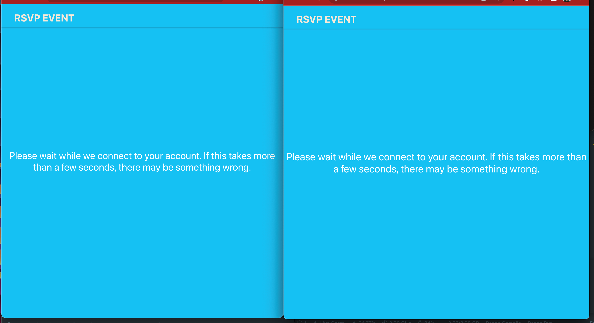
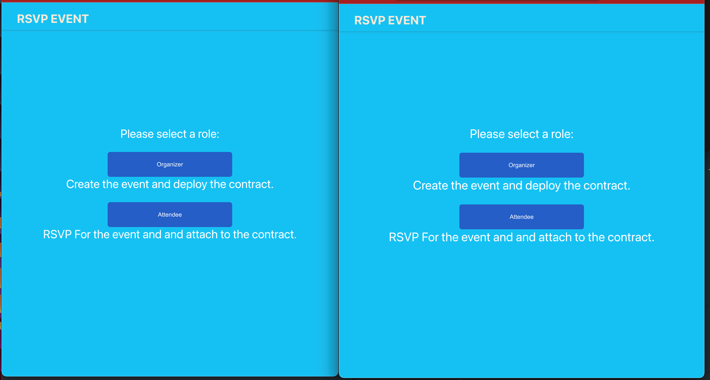
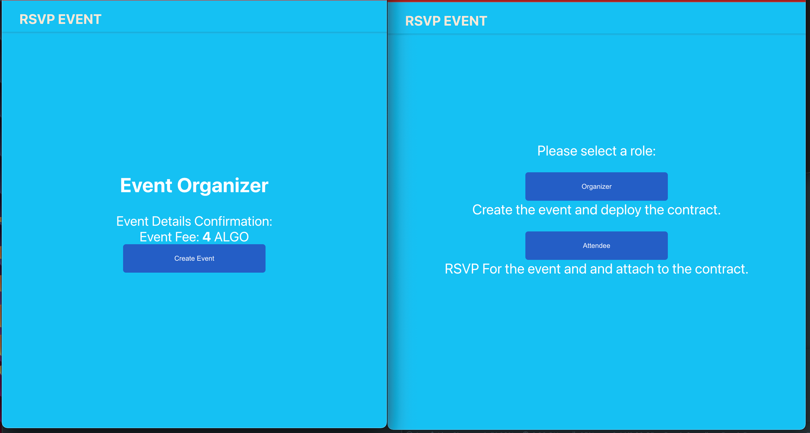
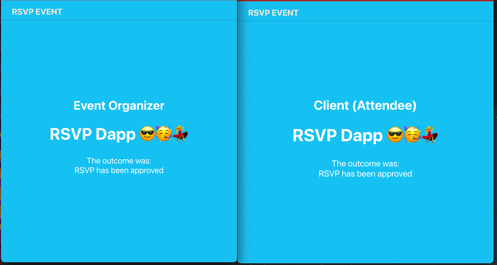

# RSVP DAPP BUILT WITH REACH DEPLOYED ON ALGORAND
Umoja 3 Bounty Hack

The RSVP DApp that allows you to purchase a ticket by paying some Algos and in return receives a non-network token which can be resold, and allowing you to get rewarded with a non-network token after you attend, and have been verified by the organizer. The platform owner also benefits from every ticket sold by the organizer.

# Features of the RSVP dApp
- Platform makes profit from sale of ticket
- Organizer sells ticket to attendee at a fee
- Attendee RSVP for the event and pays the event fee
- Oranizer can approve or decline attendee for the event
- Organizer checkin attendees that attends the events and reward checkin attendees with a reward token

# Setup Requirements
- Install [make](https://en.wikipedia.org/wiki/Make_(software)), [Docker](https://www.docker.com/get-started/) and [Docker Compose](https://docs.docker.com/compose/install/)
- [Vs Code](https://code.visualstudio.com/) or any IDE of your choice
- [Node Package Manager](https://nodejs.org/download/)
- Install Reach and Reach Standard Library
- More detailed Reach specific setup instruction can be found [here](https://docs.reach.sh/tut/rps/#tut-1)

# Run Frontend Code
To test the code
- Fork the repository
- Do `./reach init` this will install all required dependencies and creates a reach react boilerplate app. (If you enecounter an error, run `./reach down` to stop and remove the container image)
- run `./reach react` to start the local server at localhost:3000

# Test Smart Contract Code
- Ensure you have docker installed and running
- run `./reach compile`

# Future Feature Plans
- Improve on the UI
- Improve on the frontend code
- Optimise the smart contract code
- Enable contract interaction
- Platform owner receives percentage from sale of every ticket
- Implement reselling ( This will enable reselling of purchased ticket in the marketplace )
- Platform and event organizer profit profit from resale of ticket

# `Frontend demo`

`Connecting wallet to access the dashboard`

`Create an Event`

`Successful Event`
